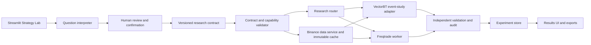

# Strategy Lab Phase 0 Specification

Status: Design frozen for review

Contract version: `0.1.0`

Runtime impact: None

## 1. Purpose

Strategy Lab will turn a human research question into a reproducible, reviewable
research job. It is a research system, not a signal oracle. Its output must state
what was tested, how it was tested, what data was used, and how uncertain the
result remains.

The first reference question is:

> How often did BTCUSDT bounce from the 9 EMA on the 5-minute timeframe over
> the previous two years?

The system must not execute this sentence directly. It must first convert it
into the typed research contract described in `RESEARCH_CONTRACT.md`.

## 2. Phase 0 Deliverables

Phase 0 contains design artifacts only:

- System boundaries and component responsibilities.
- A strict, versioned research contract.
- Validation rules and acceptance gates.
- A risk register with required mitigations.
- One machine-readable reference experiment.

Phase 0 does not add a Streamlit page, install VectorBT or Freqtrade, download
market data, run a backtest, or modify existing scanner behavior.

## 3. Initial Scope

### Included

- Binance USDT-M perpetual futures.
- Public historical Binance market data.
- Closed-bar research in UTC.
- Single-symbol event studies.
- Single-symbol executable strategy backtests.
- EMA and SMA bounce studies as the first supported research family.
- Gross and net results with explicit fees, slippage, and funding treatment.
- Chronological holdout and walk-forward validation.
- Reproducible exports containing the contract, data manifest, engine version,
  results, warnings, and run logs.

### Excluded Until A Later Approved Phase

- Live trading, order placement, or exchange credentials with trading access.
- Kiyotaka, MMT, ETF tape, and spot-volume bubble integrations.
- Arbitrage, multi-exchange, portfolio, and cross-asset strategies.
- Machine-learning model training.
- Unbounded parameter optimization.
- AI-generated Python executed without a reviewed allowlist and sandbox.
- Claims that a historical success rate is a future probability.
- Automatic promotion of a strategy to the existing scanner.

## 4. Architectural Decisions

### 4.1 Engine Routing

The research type determines the engine:

| Research type | Primary engine | Purpose |
| --- | --- | --- |
| Event study | VectorBT adapter | Count events, forward returns, barriers, and indicator comparisons |
| Executable strategy backtest | Freqtrade adapter | Position lifecycle, fees, slippage assumptions, funding, drawdown, and trade metrics |

An event question must not be forced into Freqtrade merely because Freqtrade is
available. A strategy requiring entries, exits, capital allocation, and position
state must not be presented as a simple event study.

### 4.2 AI Boundary

The AI layer may:

- Identify ambiguity.
- Suggest statistically safer definitions.
- Translate approved language into a candidate contract.
- Explain results and limitations.

The AI layer may not:

- Invent missing parameters silently.
- Modify a confirmed contract during execution.
- write arbitrary executable strategy code and run it automatically.
- Declare a result valid when an acceptance gate failed.
- Present an empirical historical rate as a calibrated future probability.

### 4.3 Fail-Closed Research

If a material term is undefined, the job remains in `needs_review` state.
Examples include:

- What counts as a touch or bounce.
- Whether entry occurs at signal close or next bar open.
- Whether target or stop wins when both occur in one candle.
- Whether overlapping events are allowed.
- Which fees, slippage, and funding assumptions apply.
- Which period is used for model selection and which is locked for final testing.

The system can propose defaults, but the confirmed contract must contain the
final values.

## 5. Proposed Component Boundaries

### Streamlit Strategy Lab

- Collects the question and structured choices.
- Shows ambiguity warnings and proposed definitions.
- Displays contract diffs before confirmation.
- Submits jobs and reads persisted status/results.
- Does not perform long-running research inside the Streamlit rerun path.

### Question Interpreter

- Converts natural language into a candidate contract using an allowlisted
  vocabulary.
- Produces questions for unresolved material fields.
- Records suggestions separately from user-approved settings.

### Contract Validator

- Validates JSON structure against `research_contract.schema.json`.
- Applies semantic checks that JSON Schema cannot express.
- Checks whether the requested features are supported by the selected engine.
- Rejects unknown fields and unsupported indicator/filter combinations.

### Binance Data Service

- Downloads raw public data and stores immutable source files locally.
- Normalizes timestamps to UTC and removes unclosed bars.
- Detects duplicates, gaps, missing intervals, and source inconsistencies.
- Creates a manifest with request parameters, retrieval time, row counts,
  checksums, and transformations.
- Keeps raw data separate from derived indicators and experiment outputs.

### VectorBT Adapter

- Runs deterministic event definitions and parameter comparisons.
- Returns event counts, forward-return distributions, barrier outcomes,
  uncertainty intervals, and cohort breakdowns.
- Uses a transparent reference calculation for parity tests.

### Freqtrade Worker

- Runs in an isolated, pinned environment.
- Accepts only compiler-generated, allowlisted strategy definitions.
- Produces standard trade, return, drawdown, and risk metrics.
- Has no live-trading credentials and no path to order placement.

### Independent Validator

- Recomputes a small reference sample without relying on the primary engine.
- Enforces chronological splits, warmup, delay, overlap, and intrabar rules.
- Verifies that costs and funding assumptions reached the reported metrics.
- Compares engine results against known fixtures and parity tolerances.

### Experiment Store And Reporter

- Stores immutable confirmed contracts and run manifests.
- Links derived runs to their parent experiment.
- Separates exploratory, validation, and final-holdout results.
- Prevents silent replacement of prior results.

## 6. Integration With The Existing Terminal

The current scanner and its snapshot-based Research page remain operationally
separate from Strategy Lab:

- `perpscanner/research.py` continues to own scanner snapshot logging, rank IC,
  event studies, and related observational statistics.
- Strategy Lab will use a new `perpscanner/strategy_lab/` package rather than
  growing the existing research module into a second system.
- Strategy Lab experiment metadata and artifacts will use a separate store under
  `data/strategy_lab/`; it will not share tables with
  `data/research_snapshots.sqlite`.
- A later Streamlit phase will add Strategy Lab as a top-level page through the
  existing navigation pattern.
- Existing Binance transport helpers may be reused only after their pagination,
  closed-bar, retry, and normalization behavior passes the Lab data contract.
- The existing scanner must not depend on VectorBT, Freqtrade, or Lab services to
  start and run.

The lower detail timeframe requested for intrabar resolution does not imply a
mandatory full-period 1-minute download. The data service should fetch and cache
only the windows needed to resolve ambiguous higher-timeframe barriers unless a
full detail dataset is explicitly required and approved.

## 7. Experiment Lifecycle

1. `draft`: Natural-language request exists, but material fields may be missing.
2. `needs_review`: The system has proposed a contract and listed ambiguities.
3. `confirmed`: The user approved the exact contract and its assumptions.
4. `validated`: Schema, semantic, capability, and data checks passed.
5. `queued`: A frozen contract and environment are ready for execution.
6. `running`: The engine is executing the frozen job.
7. `completed`: Results and reproducibility artifacts were produced.
8. `failed`: Execution failed; partial results are not promoted.
9. `invalidated`: A later audit found a material defect.

Editing a confirmed experiment creates a new revision. It never mutates the
historical contract or results.

## 8. Accuracy Principles

- Closed bars only.
- Next-bar entry is the default for signal-based research.
- Indicator state is computed using only information available at that time.
- The final holdout is not used for prompt refinement, parameter selection, or
  filter discovery.
- Every rate includes its numerator, denominator, and confidence interval.
- Every strategy result includes costs and identifies gross versus net values.
- Multiple comparisons are disclosed and corrected when indicators or
  parameters are ranked.
- A result with too few independent events is labeled inconclusive.
- Cross-engine agreement is evidence, not proof; disagreements must be resolved.
- Re-running the same frozen contract and data manifest must reproduce the result
  within documented numeric tolerances.

## 9. Initial Capability Matrix

| Capability | Contract allows | First implementation |
| --- | --- | --- |
| EMA bounce event study | Yes | Required |
| SMA bounce event study | Yes | Required |
| Multiple MA lengths | Yes | After single-study parity passes |
| RSI, VWAP, volume filters | Reserved | Disabled until independently tested |
| Long and short studies | Yes | Long first, then mirrored short tests |
| Barrier and forward-return outcomes | Yes | Required |
| Walk-forward validation | Yes | Required before strategy claims |
| Freqtrade strategy backtest | Yes | Phase 4 |
| ML models | No | Out of scope |
| Live execution | No | Prohibited |

The contract schema defines the long-term safe vocabulary. Each engine adapter
also maintains a narrower capability list. A schema-valid request can therefore
still be rejected as not yet implemented.

## 10. Phase 0 Exit Criteria

Phase 0 passes when:

- The architecture, contract, validation policy, and risks are documented.
- The JSON Schema parses and rejects unknown root and nested fields.
- The reference EMA experiment is valid against the schema.
- Material research assumptions are explicit rather than hidden in prompts.
- Event-study and executable-strategy responsibilities are separated.
- No runtime code, dependency, database, or existing scanner behavior changed.
- Open Phase 1 decisions are clearly listed.

## 11. Decisions Required Before Phase 1

Phase 1 should not begin until these decisions are confirmed:

1. Freqtrade may run through Docker Desktop or WSL2 in an isolated environment.
2. The first framework parity fixture uses hand-verified synthetic 5-minute
   candles and one EMA bounce. The two-year BTCUSDT contract is an integration
   fixture for the later data/event-study phases.
3. Research remains strictly non-live and uses public/read-only data.
4. The example cost assumptions are test inputs, not accepted real-world truth;
   final defaults will be calibrated and displayed before execution.
